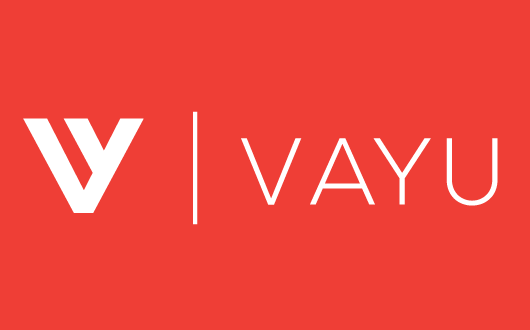
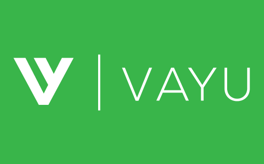
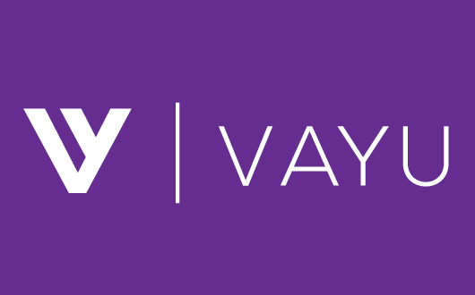

<!--### Header - Arrow ###-->

  

    <h1 class="title"> Vayu is what you need</h1>

    <h2>We specialise in test-driven development, user-centered design  
      & beautiful functioning code.</h2>

    

      

        
        
        	
      

    

  

  

    

      

        

          <h1>Why should you choose Vayu?</h1>

          <!-- <h2>Software engineering services</h2> -->

          

            <!--###   Feature 1 ###-->
            

              

                

		  
                

                <h1>Made with love</h1>

                
We love software.  Work with us &amp; we'll show you why!  

              

            

            <!--###   Feature 2 ###-->
            

              

                

		
		

                <h1>Clean design</h1>

                
We write beautiful code that would make an engineer blush

              

            

            <!--###   Feature 3 ###-->
            

              

                

		  
		  

                <h1>Responsive layouts</h1>

                
Built for mobiles from the outset. We live &amp; breathe responsive design.

              

            

          

        

      

    

  

  

    

      <h1 class="main-feat-title" id="features">
        We specialise in bespoke software
      </h1>

      <h2 class="main-feat-p">We can build the ideas in your head and make them a reality</h2>

      

        

          

            <H4>Building better applications</H4>

            
Exceptional development on the web is done with cutting-edge technologies like Ruby, React JS, Vue JS and other modern frameworks. At Vayu, we're polyglots - we use the the latest technology to rapidly bring your projects to fruition.   We also understand how to build at scale with containers & Kubernetes in our toolbelt.

            
We're always discovering and learning.  Naturally curious, we stay on top of trends and new technologies to help our clients reach future-facing solutions.

          

          

            <a href="/assets/images/frontend/mockup/main1.png" data-gal="prettyPhoto[gallery1]">
              
	      
            </a>
          

        

      

    

  

